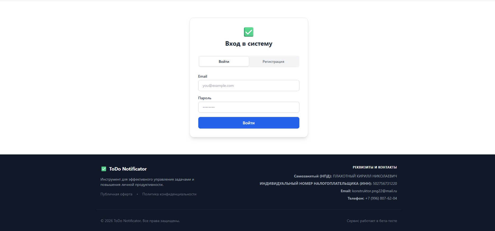
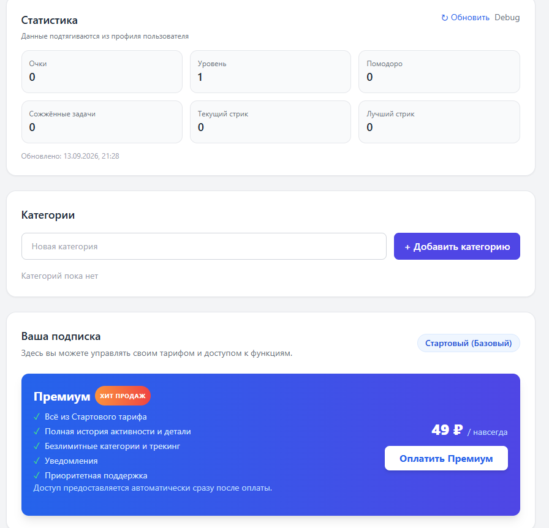
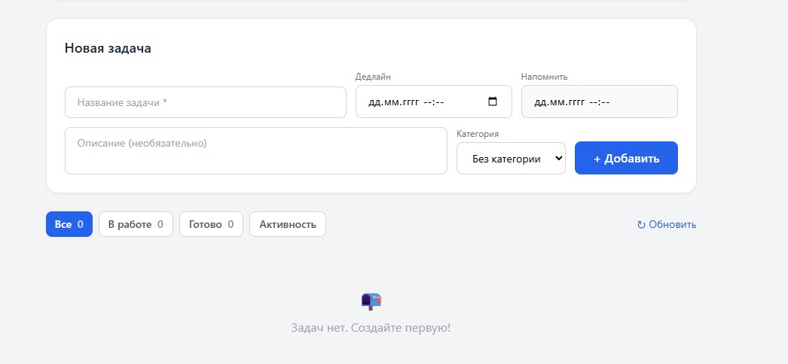
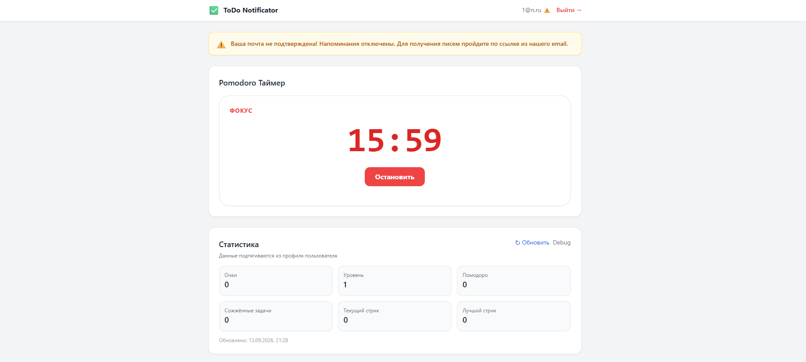

!!rule numbering lazy
!!rule numbering sections
!!rule code highlight
!!rule headings alt_style_1
!!rule hyphenation
!!rule table title style italic
!!rule code title style italic
!!rule title Руководство пользователя ToDo Notificator
!!rule author Разработчик

# ОГЛАВЛЕНИЕ

# ВВЕДЕНИЕ

ToDo Notificator — веб-система для управления личными задачами, категориями, сессиями Pomodoro, статистикой продуктивности и журналом активности.

В текущей версии используется один статический веб-клиент на Alpine.js и Tailwind CSS. React-клиент и сервисы отправки email-уведомлений в состав проекта не входят.

# 1 НАЗНАЧЕНИЕ И ТРЕБОВАНИЯ

## 1.1 Назначение

Система позволяет:
* регистрироваться и входить по email и паролю;
* создавать, редактировать, завершать и удалять задачи;
* группировать задачи по категориям;
* фиксировать дедлайн и плановое время напоминания;
* запускать и завершать сессии Pomodoro;
* просматривать очки, уровень, стрики и число Pomodoro;
* просматривать журнал действ.

Поле `Напомнить` сохраняет дату и время в задаче, но не отправляет email, push- или Telegram-уведомления.

## 1.2 Требования к рабочему месту

* современный браузер с JavaScript и `localStorage`;
* разрешение экрана от 360 px;
* доступ к `http://localhost:3030` и Backend API;
* для развертывания — Docker Desktop или Docker Engine с Compose v2.

# 2 РАЗВЕРТЫВАНИЕ

## 2.1 Запуск в Docker

Из корня репозитория выполните:

```bash Листинг [#] – Запуск локального стенда
docker compose -f docker-compose.local.yml up -d --build
```

В стенд входят пять сервисов:

Сервис | Назначение | Порт
:---|:---|:---:
`frontend-alpine` | Nginx со статическим Alpine.js-клиентом | 3030
`backend` | REST API | 8082
`activity-logger` | gRPC-аудит | 50051
`postgres` | Основные данные | 5432
`mongo` | Журнал активности | 27017

После запуска откройте `http://localhost:3030`.

## 2.2 Запуск только статического клиента

При уже запущенном Backend API:

```bash Листинг [#] – Локальная раздача статики
npx --yes http-server ./frontend -p 3030
```

# 3 РАБОТА С СИСТЕМОЙ

## 3.1 Вход и регистрация

На экране аутентификации доступны вкладки `Войти` и `Регистрация`. Для входа введите email и пароль, затем нажмите `Войти`.



Пароль при регистрации должен содержать не менее восьми символов. JWT-токены после входа хранятся в `localStorage` браузера.

## 3.2 Функции личного кабинета

В личном кабинете доступны статистика, категории, блок подписки, форма задач, Pomodoro и журнал активности.



Блок подписки носит демонстрационный характер. Онлайн-оплата и разделение прав по тарифам не входят в приемочный контур.

## 3.3 Категории

Для создания категории введите её название и нажмите `+Добавить категорию`. Созданную категорию можно выбрать в форме задачи, переименовать или удалить.

## 3.4 Задачи

При создании задачи задайте:
* обязательное название;
* описание;
* дедлайн;
* плановое время напоминания;
* категорию.



Карточка задачи позволяет изменить статус, открыть форму редактирования, запустить Pomodoro и удалить задачу. Доступны режимы `Все`, `В работе`, `Готово` и `Активность`.

## 3.5 Pomodoro

Таймер можно запустить как без задачи, так и из карточки задачи. Во время фокуса отображаются оставшееся время и кнопка остановки.



При остановке пользователь выбирает результат сессии. Успешно завершённые интервалы учитываются в статистике.

## 3.6 Статистика и аудит

Панель статистики отображает очки, уровень, количество Pomodoro, сожжённые задачи, текущий и лучший стрик. Кнопка `Обновить` повторно загружает данные.

В режиме `Активность` показываются события создания, изменения и удаления сущностей, а также действия Pomodoro. Данные аудита хранятся в MongoDB.

# 4 ДИАГНОСТИКА

Проверка контейнеров:

```bash
docker compose -f docker-compose.local.yml ps
```

Просмотр логов:

```bash
docker compose -f docker-compose.local.yml logs -f backend
docker compose -f docker-compose.local.yml logs -f frontend-alpine
docker compose -f docker-compose.local.yml logs -f activity-logger
```

Если интерфейс не открывается, проверьте свободу порта `3030` и состояние `frontend-alpine`. Если интерфейс открывается, но данные не загружаются, проверьте `backend`, `postgres`, `activity-logger` и `mongo`.

# ЗАКЛЮЧЕНИЕ

Текущая версия ToDo Notificator предоставляет единый статический веб-интерфейс для работы с задачами, Pomodoro, статистикой и аудитом. Автономный Docker-стенд не зависит от почтовых или иных внешних сервисов.
